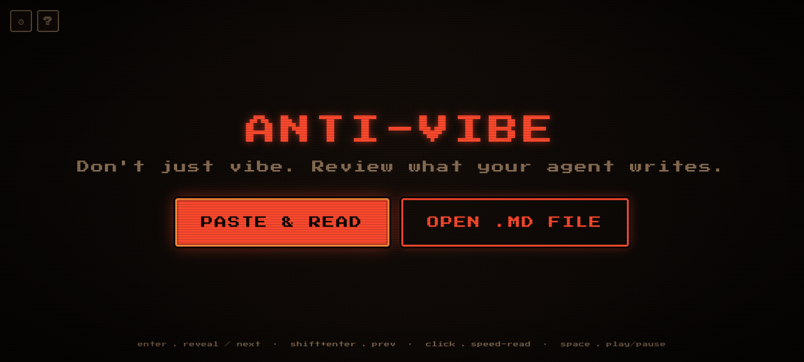
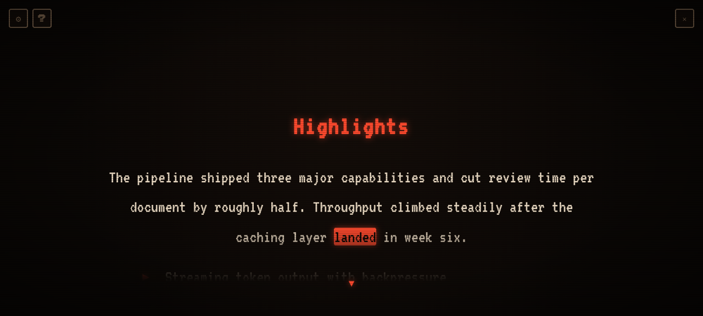
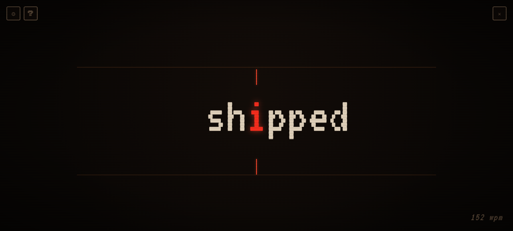

# Fixate

### Focused review, without the fatigue.

A retro-cyberpunk reader for **reviewing LLM / agent output without the fatigue**. Move through generated markdown section by section, glance at each, and speed-read the parts worth it on demand — eyes still, content moving.

> **RSVP** (Rapid Serial Visual Presentation) shows information one item at a time in the same spot. Instead of reading a paragraph at your own pace, words flash by in the center of your vision. It's speed-reading where the content moves, not your gaze — easier to process without scrolling or darting your eyes around.

## Why

LLMs and agents generate walls of text, and the cost of reviewing it is real — not just the time. This app attacks that cost from several sides:

- **Less reading fatigue** — RSVP keeps your eyes still (the content moves, your gaze doesn't), and the cursor spotlight + CRT fade limit what's on screen at once, easing the load.
- **Lower inertia to review** — section-by-section navigation means you commit to one small chunk at a time instead of facing the whole document. Glance at a heading, decide, skip it or speed-read it.
- **Faster review** — opt-in RSVP blasts through the sections worth reading at your target WPM; review keeps pace with how much AI output you now generate.
- **Less screen time** — faster, gentler review means fewer hours staring at walls of text.

The goal is review tooling that's **easier on your eyes and attention**, not only quicker — a small health/wellbeing angle baked into a speed tool. See [`docs/VISION.md`](./docs/VISION.md) for where it could go.

## Screenshots

|                                                   |                                                            |                                                  |
| ------------------------------------------------- | ---------------------------------------------------------- | ------------------------------------------------ |
|           |       |     |
| **Landing** — paste or open a `.md` file          | **Reading view** — section under a cursor spotlight + CRT fade | **RSVP** — one word at a time, ORP pivot in red |

## Features

- **Load** — paste markdown from the clipboard, or open a `.md` file.
- **Section navigation** — the doc is split into heading-delimited sections. You land on a heading; **Enter** reveals a focus-sized preview of its content, **Enter** again moves to the next section, **Shift+Enter** goes back. Skim heading-to-heading without reading everything.
- **Opt-in RSVP** — when a section looks worth speed-reading, **click any word** and RSVP plays that section from there. Words flash centered with the ORP/pivot letter pinned to a reticle; speed ramps from slow to your target WPM (and re-ramps on each start). `space` pauses back to the reading view.
- **Step mode** — for the gentlest read, **Cmd/Ctrl + Enter** steps through a section one unit at a time: a sentence, a list item, or a table row (shown as header→value pairs), with a context label (`PARAGRAPH`, `LIST · 2/4`, `TABLE · ROW 1/3`) so you always know where you are in the layout. `Enter` advances, `Shift+Enter` goes back.
- **CRT reading view** — a revealed section shows in full inside a scrollable pane that dissolves toward the top and bottom edges (CRT-style fade), under a cursor spotlight that lights the text you point at. Scroll with the arrow keys; **Cmd/Ctrl + scroll** resizes the spotlight.
- **Markdown-aware** — headings, lists, blockquotes, fenced code, tables, and images render as styled markdown; prose centered, list items bulleted, line breaks preserved.
- **Help** — a `?` icon beside the settings gear opens a menu of the shortcuts for the current view.
- **Sound** — chiptune blips on interactions (synthesized, no audio files); toggle in settings.
- **Configurable** — target/start WPM, words-per-flash, and spotlight illumination radius (saved to localStorage; settings reachable from the landing page and the reader).
- **Keyboard** — one axis of focus: `enter` **fixate deeper** (heading → reveal → step → next unit) · `shift+enter` step back · `cmd/ctrl+enter` **RSVP the section from the start** (any level) · `space` pause/resume RSVP · `esc` **up one level** (never to landing — the ✕ exits). Arrows are contextual: in the **heading list** `↑`/`↓` move between headings; in the **reading view** `↑`/`↓` scroll and `←`/`→` scroll wide content; in **step mode** `←`/`→` move between units. To jump across sections, **`⌘`/`ctrl` + arrow** (down/right = next, up/left = prev) — always landing in the next section's reading view. A minimal arrow hint appears at the reachable edge (also clickable).
- **Theme** — retro-cyberpunk pixelated: dark warm palette, red/orange accents, pixel fonts, CRT scanlines. The reading font is swappable via the `--word-font` CSS variable.

## Run

```bash
npm install
npm run dev
```

Opens on `http://localhost:5173`. Copy some markdown and click **PASTE & READ**, or **OPEN .MD FILE**.

### Tests

```bash
npm test          # run unit tests once (Vitest)
npm run test:watch
```

Unit tests cover the pure logic: ORP pivot + WPM ramp + per-word timing (`timing.ts`), chunk gathering (`chunk.ts`), and the markdown → token-stream parse (`parseMarkdown.ts`).

> Clipboard access needs a secure context. On `localhost` it works; if the browser blocks it, the app falls back to a paste box.

## Stack

Vite · React · TypeScript · [unified](https://unifiedjs.com/) / remark (markdown AST) · Zustand (playback state).

## Architecture

Markdown is parsed once (`src/lib/parseMarkdown.ts`) into a flat **token stream** with a global index — word tokens and atomic-block tokens. That index is the single source of truth linking RSVP playback to click-to-resume in the pause view. The playback loop is a self-rescheduling `setTimeout` in a Zustand store (`src/store/readerStore.ts`); per-word timing lives in `src/lib/timing.ts`.

## Roadmap

- Global hotkey to capture selected text from any app (beyond clipboard paste).
- Sound effects on list items and section changes.
- Non-markdown / plain-text and HTML input.
- Customizable fonts and themes in-app.
- More pause-mode controls (rewind by sentence, bookmarks).

## License

MIT — see [LICENSE](./LICENSE).
