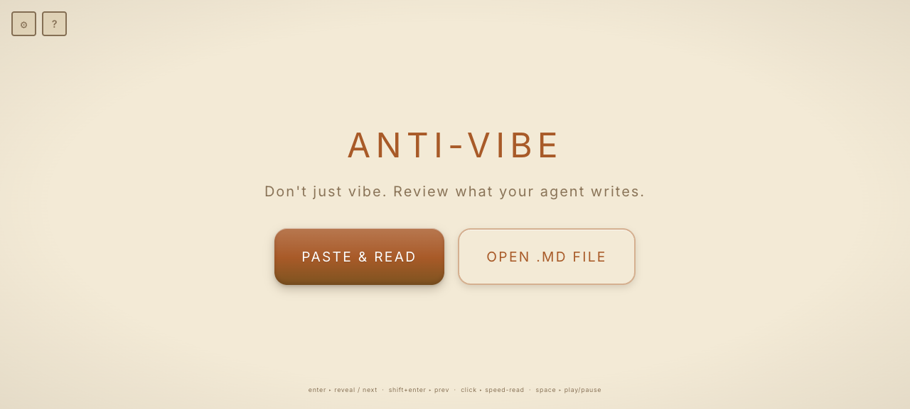
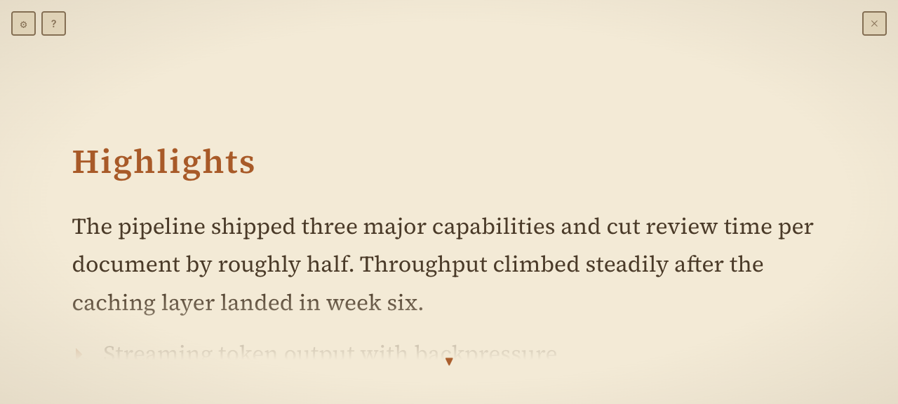
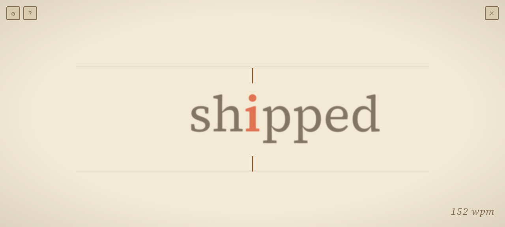
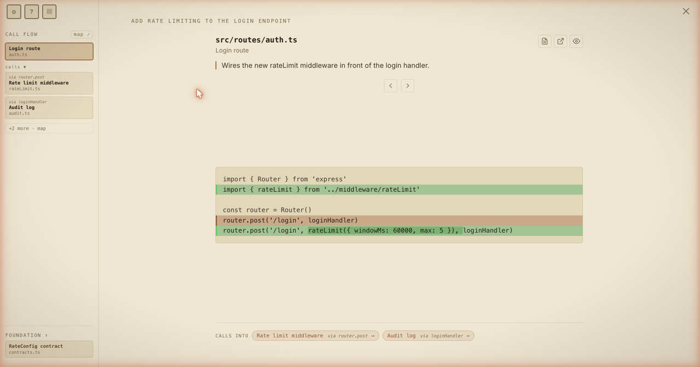

# Anti-Vibe

### Your agent wrote 800 lines in 4 seconds. You read 6 of them and hit "Approve." Be honest.

**▸ Live at [anti-vibe.pages.dev](https://anti-vibe.pages.dev)**

"Vibe coding" is letting the AI cook and merging whatever it hands back on faith. Fun, fast, and a great way to ship a bug you'll spend Saturday debugging. **Anti-Vibe is the retro-cyberpunk reader for people who actually read the diff** — LLM / agent output, reviewed section by section without the fatigue that makes you give up and click "Approve" at line 6.

Glance at a heading, decide, skip it or speed-read it. Or walk a code change in the order it actually *runs*, one hunk at a time. Eyes still, content moving, no wall of text to bounce off.

> **RSVP** (Rapid Serial Visual Presentation) shows information one item at a time in the same spot. Instead of reading a paragraph at your own pace, words flash by in the center of your vision. It's speed-reading where the content moves, not your gaze — easier to process without scrolling or darting your eyes around.

> **Full disclosure:** yes, a tool for *not* vibe coding is itself vibe coded — for now. The irony is not lost on us; we're firing shots from inside the glass house. The plan is to close the loop and use Anti-Vibe on its own source until it's earned its way out of "vibe coded" and into "actually reviewed."

## Why

LLMs and agents generate walls of text faster than any human can read them, and the cost of reviewing it is real — not just the time. This app attacks that cost from several sides:

- **Less reading fatigue** — RSVP keeps your eyes still (the content moves, your gaze doesn't), and the CRT top/bottom fade keeps the focus on the middle of the screen, easing the load.
- **Lower inertia to review** — section-by-section navigation means you commit to one small chunk at a time instead of facing the whole document. Glance at a heading, decide, skip it or speed-read it.
- **Faster review** — opt-in RSVP blasts through the sections worth reading at your target WPM; review keeps pace with how much AI output you now generate.
- **Less screen time** — faster, gentler review means fewer hours staring at walls of text.
- **Easier to focus (great for ADHD)** — one word, one sentence, or one section at a time, fixed in place, with everything else dimmed away. By removing the wall of text — and any progress counter or sense of how much is left — Anti-Vibe keeps attention on the single thing in front of you, which can make focusing and *starting* far easier for ADHD and other attention/focus challenges.

The goal is review tooling that's **easier on your eyes and attention**, not only quicker — a focus and wellbeing angle baked into a speed tool. See [`docs/VISION.md`](./docs/VISION.md) for where it could go.

## Screenshots

Shown in the **Cream** theme (warm, soft, left-aligned prose). There's also a **CRT** theme — dark, pixel, scanlines — if you want your code review to feel like it's coming from a 1983 terminal.

**Landing — paste or open a `.md` file**



**Reading view — a section with a top/bottom fade**



**RSVP — one word at a time, ORP pivot accented**



**Flow Review — a code change walked in runtime order, one hunk at a time**



## Features

- **Load** — paste markdown from the clipboard, or open a `.md` file.
- **Section navigation** — the doc is split into heading-delimited sections. You land on a heading; **Enter** reveals a focus-sized preview of its content, **Enter** again moves to the next section, **Shift+Enter** goes back. Skim heading-to-heading without reading everything.
- **Opt-in RSVP** — when a section looks worth speed-reading, **click any word** and RSVP plays that section from there. Words flash centered with the ORP/pivot letter pinned to a reticle; speed ramps from slow to your target WPM (and re-ramps on each start). `space` pauses back to the reading view.
- **Step mode** — for the gentlest read, **Cmd/Ctrl + Enter** steps through a section one unit at a time: a sentence, a list item, or a table row (shown as header→value pairs), with a context label (`PARAGRAPH`, `LIST · 2/4`, `TABLE · ROW 1/3`) so you always know where you are in the layout. `Enter` advances, `Shift+Enter` goes back.
- **CRT reading view** — a revealed section shows in full inside a scrollable pane that dissolves toward the top and bottom edges (CRT-style fade). Scroll with the arrow keys.
- **Markdown-aware** — headings, lists, blockquotes, fenced code, tables, and images render as styled markdown; prose centered, list items bulleted, line breaks preserved.
- **Help** — a `?` icon beside the settings gear opens a menu of the shortcuts for the current view.
- **Sound** — chiptune blips on interactions (synthesized, no audio files); toggle in settings.
- **Configurable** — target/start WPM and words-per-flash (saved to localStorage; settings reachable from the landing page and the reader).
- **Keyboard** — one axis of focus: `enter` **focus deeper** (heading → reveal → step → next unit) · `shift+enter` step back · `cmd/ctrl+enter` **RSVP the section from the start** (any level) · `space` pause/resume RSVP · `esc` **up one level** (never to landing — the ✕ exits). Arrows are contextual: in the **heading list** `↑`/`↓` move between headings; in the **reading view** `↑`/`↓` scroll and `←`/`→` scroll wide content; in **step mode** `←`/`→` move between units. To jump across sections, **`⌘`/`ctrl` + arrow** (down/right = next, up/left = prev) — always landing in the next section's reading view. Once you finish a section (scrolled to the bottom, or reached the last step), a small **advance button** appears at the bottom — click it to go to the next section.
- **Theme** — two built-in themes (Cream and CRT); the reading font is swappable via the `--word-font` CSS variable.

## Flow Review — read the diff, not the file list

The feature vibe coding hopes you never use. **Flow Review walks a code change in the order it actually runs** — entry → handler → service → effect, like stepping through a sequence diagram — instead of the alphabetical file dump your git tool gives you. One hunk at a time, always showing where you are in the call flow.

- **Runtime order, not file order** — the agent describes the traversal structure; Anti-Vibe runs `git diff` and resolves each stop to its real hunks. You follow the *call graph*, branching where a function calls several others.
- **Foundation lane** — models / schemas / contracts / types sit pinned at the bottom, read *after* you've seen how they're used.
- **Minimap** — click any node to jump; the call-flow lane shows edges and the path you've walked.
- **Focus mode + open-in-editor** — `Enter` hides the chrome to one hunk; per-hunk deep links open in VS Code / Cursor / Windsurf / Zed / JetBrains / a custom template.
- **Keys** — `← / →` (or `j / k`) step hunks and follow the graph; `1–9` pick a branch; `Enter`/`Esc` focus and back out.

Driven by the `review_flow` MCP tool (below). Full docs: [`docs/FLOW-REVIEW.md`](./docs/FLOW-REVIEW.md).

## Run

```bash
npm install
npm run dev
```

Opens on `http://localhost:5173`. Copy some markdown and click **PASTE & READ**, or **OPEN .MD FILE**.

No install needed to try it — the latest build is hosted at **[anti-vibe.pages.dev](https://anti-vibe.pages.dev)**.

### Tests

```bash
npm test          # run unit tests once (Vitest)
npm run test:watch
```

Unit tests cover the pure logic: ORP pivot + WPM ramp + per-word timing (`timing.ts`), chunk gathering (`chunk.ts`), and the markdown → token-stream parse (`parseMarkdown.ts`).

> Clipboard access needs a secure context. On `localhost` it works; if the browser blocks it, the app falls back to a paste box.

## Stack

Vite · React · TypeScript · [unified](https://unifiedjs.com/) / remark (markdown AST) · Zustand (playback state).

## Architecture

Markdown is parsed once (`src/lib/parseMarkdown.ts`) into a flat **token stream** with a global index — word tokens and atomic-block tokens. That index is the single source of truth linking RSVP playback to click-to-resume in the pause view. The playback loop is a self-rescheduling `setTimeout` in a Zustand store (`src/store/readerStore.ts`); per-word timing lives in `src/lib/timing.ts`.

## MCP server

Anti-Vibe ships an [MCP](https://modelcontextprotocol.io) STDIO server (`mcp/`) so an AI agent can push its output straight into the reader for review — no copy-paste.

Because Anti-Vibe is a static SPA with no backend, the MCP process also runs a tiny **localhost bridge**: it serves the built app from its own origin and live-pushes documents to the open tab over Server-Sent Events. Three tools:

- **`review_markdown`** — `{ markdown, title? }` → normalizes the markdown (CRLF→LF, optional `# title`), validates it parses, sends it to the reader, and opens the tab on first use. Preserves code blocks, tables and structure verbatim. Returns `{ documentId, sectionCount, wordCount, url }`.
- **`rsvpify_markdown`** — `{ markdown, title? }` → same transport, but for content a human will *speed-read*. The agent must first rewrite its output into flowing prose (full sentences, no bullet fragments), replace each code block with a short prose summary of what it does, and keep essential tables verbatim (Anti-Vibe auto-pauses the RSVP stream on them). Returns `{ documentId, sectionCount, wordCount, url }`.
- **`review_flow`** — `{ stops, title?, repoPath?, diffBase? }` → pushes a **flow-ordered code review**. The agent sends only the traversal *structure* (stops tagged `flow` / `foundation`, wired by `callsTo`, with per-hunk reading order via `hunkFlow`) — never the diff text. Anti-Vibe runs `git diff` in the repo and resolves each stop to its real hunks. Returns `{ documentId, stopCount, resolvedCount, url }`. See [`docs/FLOW-REVIEW.md`](./docs/FLOW-REVIEW.md) for the full input schema and `diffBase` forms.

The server ships as a separate self-contained npm package, [`anti-vibe-mcp`](./mcp), that bundles a built copy of the web app — so the bridge always serves a matching front-end with no clone or build step for end users.

### Use it (end users)

Add it to your MCP client (Claude Desktop `claude_desktop_config.json`, or `claude mcp add`):

```json
{
  "mcpServers": {
    "anti-vibe": {
      "command": "npx",
      "args": ["-y", "anti-vibe-mcp"],
      "env": { "ANTIVIBE_MCP_PORT": "7777" }
    }
  }
}
```

Then ask the agent to "send this to Anti-Vibe for review". The first call opens `http://127.0.0.1:7777`; later calls update the same tab. `ANTIVIBE_MCP_PORT` (default `7777`) is also the review URL.

### Run from source (contributors)

Cloning this repo auto-registers the server via the committed `.mcp.json` (it runs `mcp/server.ts` with `tsx`). Just install and build once so the bridge has a front-end to serve:

```bash
npm install
npm run build    # the bridge serves dist/
npm run mcp      # optional: launch the server standalone for testing
```

### Publishing the package

```bash
npm run build:mcp      # vite build -> dist/, bundle mcp/server.ts -> mcp/bin, copy dist -> mcp/app
npm run release:mcp    # build:mcp then `npm publish mcp`
```

> The bridge listens on loopback only. The browser-side receiver is a silent no-op anywhere except behind the bridge, so the deployed app and `npm run dev` are unaffected. The web app and the `anti-vibe-mcp` package are versioned and shipped independently.

## Roadmap

- Non-markdown / plain-text and HTML input.
- Customizable fonts and themes in-app.
- Resumability — pick a review back up where you left off.
- Mobile sync — start on desktop, keep going on your phone.

## License

MIT — see [LICENSE](./LICENSE).
